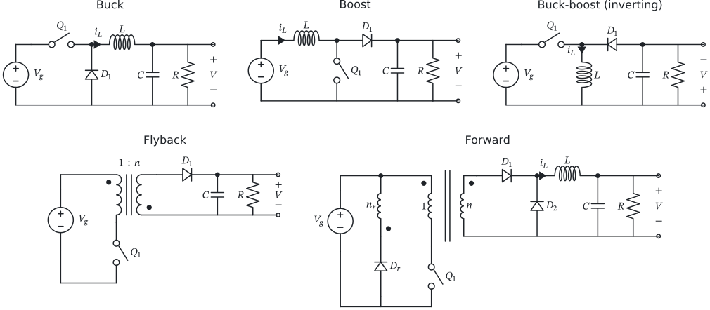
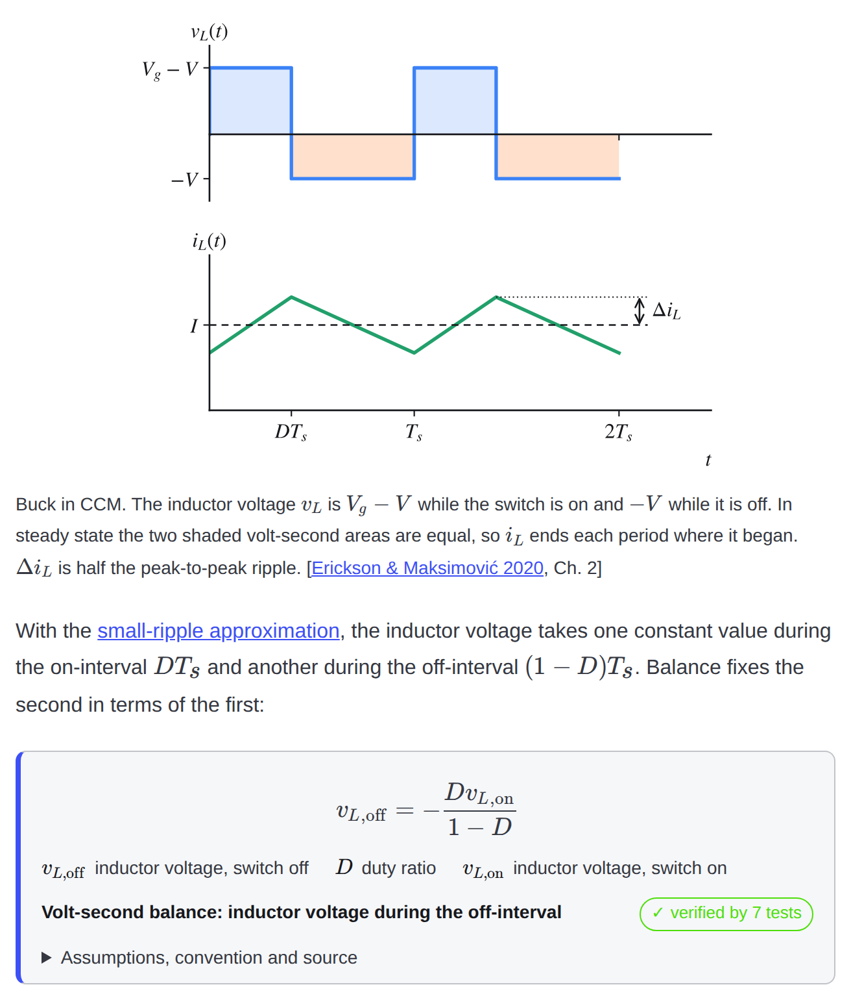
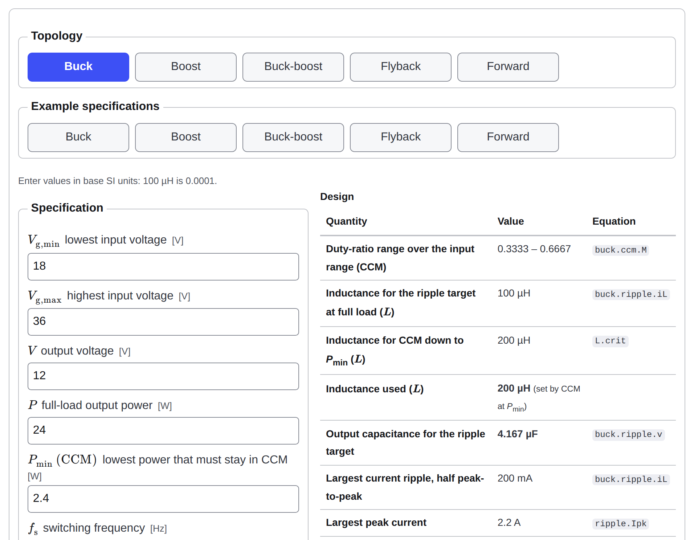
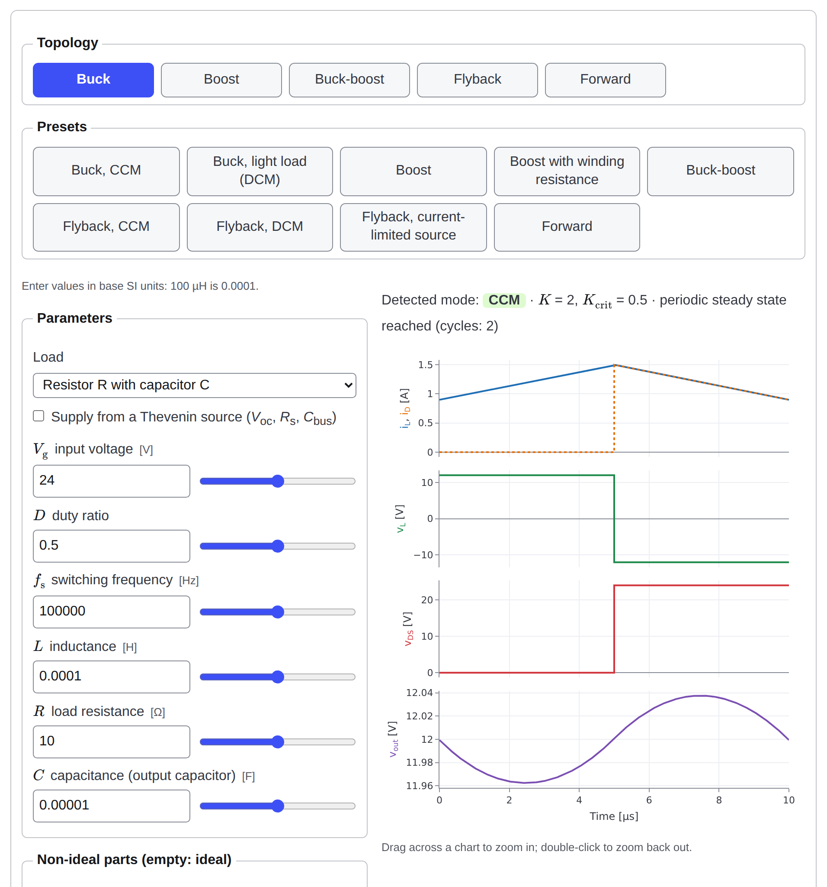
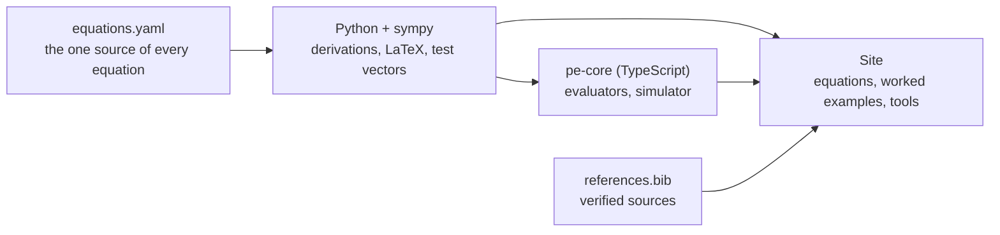
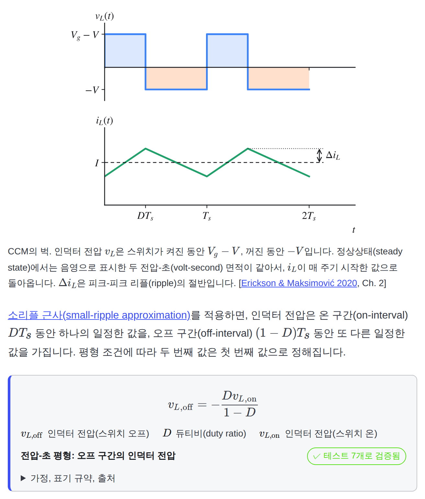
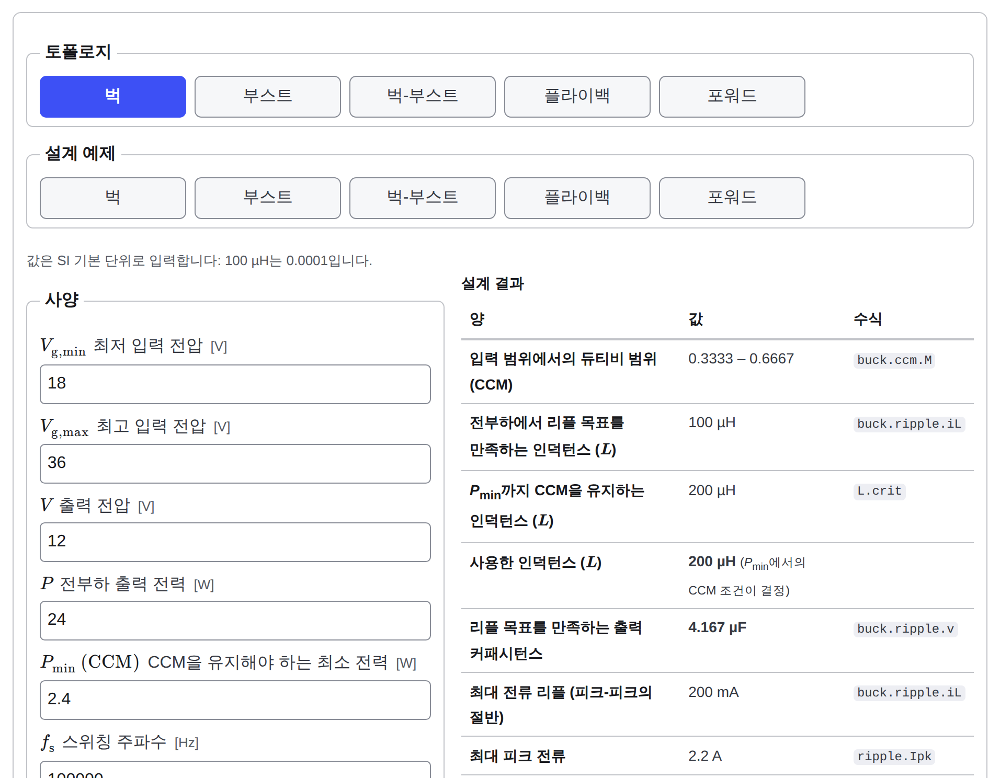
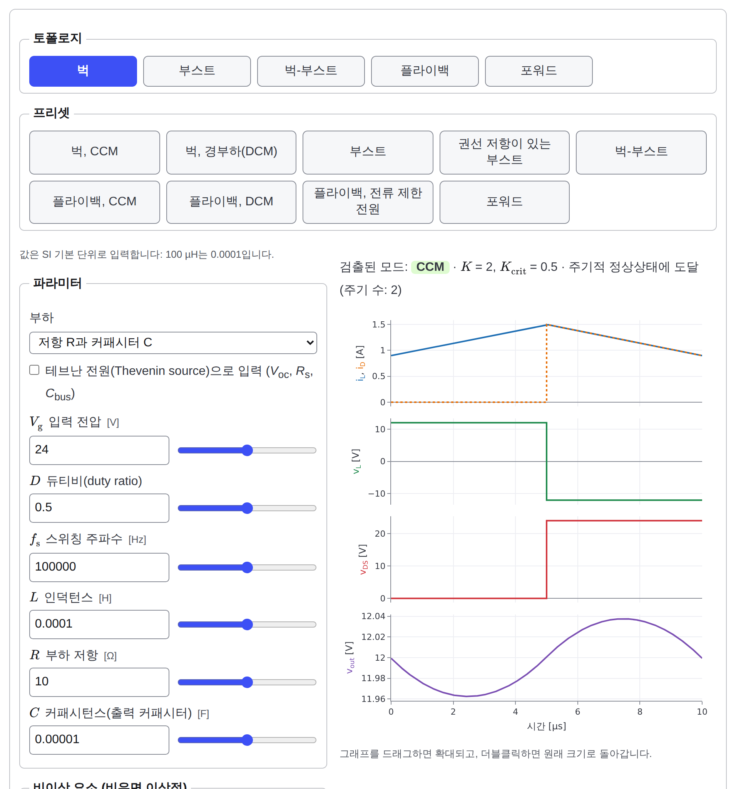
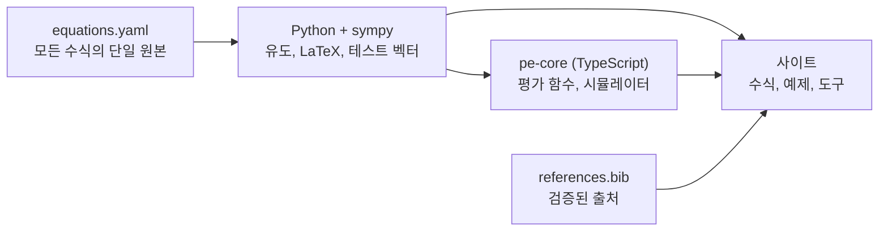

<div align="center">

# Switching Converter Study · 스위칭 컨버터 스터디

**Learn, design and simulate switching power converters, with every equation derived, tested and cited.**<br>
**스위칭 전력 컨버터를 배우고, 설계하고, 시뮬레이션합니다. 모든 수식은 유도·검증·인용됩니다.**

[](https://github.com/Denny-Hwang/switching_converter_study/actions/workflows/ci.yml)
[](https://github.com/Denny-Hwang/switching_converter_study/actions/workflows/pages.yml)

**[Open the site (English)](https://denny-hwang.github.io/switching_converter_study/en/)** · **[사이트 열기 (한국어)](https://denny-hwang.github.io/switching_converter_study/ko/)**



[English](#english) · [한국어](#한국어)

</div>

---

## English

An open, bilingual learning repository on power electronics for electrical
engineers, and a web app that puts **learning**, **design** and
**simulation** in one place. It covers switching-converter theory
(CCM/DCM), the basic topologies, magnetics and losses, energy-harvesting
interfaces and bench practice, with LTspice, ngspice and CircuitJS1
(Falstad) files for the five basic converters and nine missions that put the
pages and tools to work.

<table>
<tr>
<td width="50%" valign="top">

**Learn.** Each page states what it teaches, derives the result, and
explains every symbol beside the equation. It then works an example,
links to a tool preset, lists the gotchas and ends with a quiz.



</td>
<td width="50%" valign="top">

**Design.** Calculators for the converter, its magnetics, its losses, the
flyback clamp, the harvesting source and the current-sense chain. Each
result names the equation it comes from.



</td>
</tr>
<tr>
<td colspan="2" valign="top">

**Simulate.** A time-domain simulator in the browser: pick a topology, move a
slider and watch the waveforms, the operating mode and the losses change.
Step through the period mode by mode, with the circuit's current paths and
each element's state. Every result sits next to the formula's value, and the
simulator is validated against the formulas to within 2 % and against
ngspice.



</td>
</tr>
</table>

### How the numbers stay right



- Every equation is written once, in `packages/pe-core/equations/equations.yaml`.
  sympy reproduces its derivation and generates its LaTeX. The TypeScript
  engine must match the Python reference on shared test vectors to 1e-9
  relative.
- Every equation and every claim about a device or method cites a
  verified entry of `references.bib`. CI checks each DOI against Crossref,
  opens each link, and fails on a dead one.
- Math renders with KaTeX in strict mode. Figures are drawn from code
  (`scripts/gen_figures.py`). A privacy scan keeps real-project data out
  (`PRIVACY_RULES.md`): example numbers are round teaching values.

### Contents

| Section | Pages |
| --- | --- |
| 00 Foundations | circuit laws, phasors and Laplace, Fourier series, real passives, semiconductor switches |
| 01 Physics | Faraday's law and inductors, transformers, ferrites and B-H, air gap and A_L, core loss |
| 02 Theory | switching principle, volt-second and charge balance, CCM and DCM, the K parameter, averaged models, small-signal models, the RHP zero, control basics, derivations |
| 03 Topologies | buck, boost, buck-boost, flyback, forward, comparison |
| 04 Magnetics | inductor design procedure, winding loss, leakage inductance, snubbers and clamps, measuring magnetics |
| 05 Simulation | the SPICE library in LTspice and ngspice (directives, how long to run, integration settings), the same circuits in CircuitJS1 (its fixed step and the spike where a diode's current has nowhere to go), verifying with Python, how the in-browser simulator works |
| 06 Bench | PCB layout, gate drive, current sensing, probes and measurement bandwidth, thermal design, protection, low temperature |
| 07 Harvesting | source models, matching, the DCM flyback as a loss-free resistor, SECE, SSHI and MPPT, a design case |
| 08 Gotchas | thirteen bench and design mistakes, each from its symptom to its fix |
| 09 Missions | nine missions with acceptance criteria and a progress tracker kept in the browser |
| 10 Resources | books, courses, videos, application notes, tools and papers, each opened and checked; the bibliography |
| Tools | equation explorer, simulator, converter designer, magnetics designer, loss budget, clamp check, source matcher, sense chain |
| SPICE library | `sim/`: the five converters as LTspice schematics and ngspice netlists, with what to plot and the numbers to expect, and as CircuitJS1 circuits that open on falstad.com |

### Run it locally

Requirements: Node.js ≥ 22.12, Python ≥ 3.11.

```sh
npm install && npm run dev   # site and tools at http://localhost:4321/switching_converter_study/
npm test                     # vitest: pe-core, simulator validation, TS/Python parity
```

<details>
<summary>All checks, as CI runs them</summary>

```sh
npm run build                          # strict KaTeX build (fails on a math error)
pip install -e "python[dev]" && pytest # sympy derivations and test vectors
python scripts/gen_equations.py        # regenerate LaTeX, test vectors, derivations, bibliography JSON
pip install -e "python[figures]" && python scripts/gen_figures.py   # redraw the figures
python scripts/mathlint.py             # no hand-typed equations; every <Eq> id exists
python scripts/modulelint.py           # module template, EN/KO mirroring, STATUS.md
python scripts/privacy_scan.py         # privacy rules
python scripts/refcheck.py             # citation keys and VERIFY flags
python scripts/anchorcheck.py dist     # every #fragment link lands (after the build)
node scripts/keyboard_check.mjs        # keyboard focus order of the tool pages (after the build)
node scripts/seq_check.mjs             # the operating-mode drawing's real text boxes (after the build)
```

</details>

### Repository map

| Path | Contents |
| --- | --- |
| `CLAUDE.md`, `PRIVACY_RULES.md` | binding conventions; what may never be committed |
| `docs/BUILD_SPEC.md`, `docs/STATUS.md`, `docs/ADR/` | build specification and phases; module status; decision records |
| `packages/pe-core/` | TypeScript engine; `equations/` holds the one source of truth |
| `python/pe_core/` | verification: sympy derivations, LaTeX and vector generation |
| `examples/synthetic/` | the parameter sets behind every worked example and preset |
| `sim/` | the SPICE library: LTspice schematics, ngspice netlists, CircuitJS1 circuits and share links, their READMEs and waveforms |
| `scripts/` | generators, lints, screenshots |
| `src/` | Astro + Starlight site: pages (`content/docs/en`, `content/docs/ko`), components, tools |

### Roadmap

| Phase | Scope | State |
| --- | --- | --- |
| 0 | Scaffold, CI, Pages deployment, equation pipeline | done |
| 1 | Equation engine: derivations, parity, math and citation lints | done |
| 2 | Core content: foundations, physics, theory, topologies (EN + KO) | done |
| 3 | Time-domain simulator and design tools: simulator, converter designer, magnetics designer, loss budget, clamp check, source matcher, sense chain | done |
| 4 | Magnetics, bench, harvesting, gotchas, resources | done |
| 5 | LTspice/ngspice library, CircuitJS1 circuits, missions and simulation pages (done); v0.1.0 | in progress |

### Contributing and licences

See `CONTRIBUTING.md` for the module template, the equation workflow and
the citation rules. Documentation: CC BY-SA 4.0 (`LICENSE-DOCS`). Code: MIT
(`LICENSE-CODE`).

---

## 한국어

전기공학 엔지니어를 위한 전력전자 공개 학습 저장소(영어 원본, 한국어 미러)이자
**학습**, **설계**, **시뮬레이션**을 한곳에 모은 웹 앱입니다. 스위칭 컨버터
이론(CCM/DCM), 기본 토폴로지, 자성 부품, 손실, 에너지 하베스팅 인터페이스, 벤치
실습을 다루며, 다섯 가지 기본 컨버터의 LTspice·ngspice·CircuitJS1(Falstad) 파일과
페이지·도구를 직접 써 보는 아홉 가지 미션을 함께 제공합니다.

<table>
<tr>
<td width="50%" valign="top">

**학습.** 각 페이지는 목표를 밝히고 결과를 유도하며, 수식 바로 옆에서 모든
기호를 설명합니다. 이어서 예제를 풀고, 도구 프리셋으로 연결하고, 주의할 점을
짚은 뒤 퀴즈로 마무리합니다.



</td>
<td width="50%" valign="top">

**설계.** 컨버터, 자성 부품, 손실, 플라이백 클램프, 하베스팅 전원, 전류 센싱
체인을 위한 계산 도구입니다. 모든 결과에 그 값을 낸 수식이 표시됩니다.



</td>
</tr>
<tr>
<td colspan="2" valign="top">

**시뮬레이션.** 브라우저에서 동작하는 시간 영역(time-domain) 시뮬레이터입니다.
토폴로지를 고르고 슬라이더를 움직이면 파형, 동작 모드, 손실이 바로 바뀝니다.
모든 결과가 수식의 값과 나란히 표시되며, 시뮬레이터는 수식과 2 % 이내로
일치하도록 검증됩니다.



</td>
</tr>
</table>

### 수치가 정확하게 유지되는 방법



- 모든 수식은 `packages/pe-core/equations/equations.yaml`에 한 번만 적습니다.
  sympy가 유도 과정(derivation)을 재현하고 LaTeX를 생성하며, TypeScript 엔진은
  공유 테스트 벡터에서 Python 기준 구현과 상대 오차 1e-9 이내로 일치해야 합니다.
- 모든 수식과, 소자·방법에 대한 모든 주장은 `references.bib`의 검증된 항목을
  인용합니다. CI는 모든 DOI를 Crossref와 대조하고 모든 링크를 열어 보며,
  끊어진 링크가 있으면 실패합니다.
- 수식은 KaTeX 엄격 모드(strict mode)로 렌더링하고, 그림은 코드로 그립니다
  (`scripts/gen_figures.py`). 개인정보 스캔이 실제 프로젝트의 데이터를 막으며
  (`PRIVACY_RULES.md`), 예제 수치는 교육용 어림수입니다.

### 내용

| 구분 | 페이지 |
| --- | --- |
| 00 기초 | 회로 법칙, 페이저와 라플라스 변환, 푸리에 급수, 실제 수동 소자, 반도체 스위치 |
| 01 물리 | 패러데이 법칙과 인덕터, 변압기, 페라이트와 B-H 곡선, 공극과 A_L, 코어 손실 |
| 02 이론 | 스위칭 원리, 전압-초 평형과 전하 평형, CCM과 DCM, K 파라미터, 평균 모델, 소신호 모델, 우반평면(RHP) 영점, 제어 기초, 유도 과정 |
| 03 토폴로지 | 벅, 부스트, 벅-부스트, 플라이백, 포워드, 비교 |
| 04 자성 부품 | 인덕터 설계 절차, 권선 손실, 누설 인덕턴스, 스너버와 클램프, 자성 부품 측정 |
| 05 시뮬레이션 | LTspice·ngspice로 보는 SPICE 라이브러리(지시문, 실행 길이, 적분 설정), CircuitJS1로 보는 같은 회로(고정 시간 간격, 전류가 갈 곳 없는 다이오드에서 생기는 스파이크), Python으로 검증하기, 브라우저 시뮬레이터의 동작 원리 |
| 06 벤치 | PCB 레이아웃, 게이트 구동, 전류 센싱, 프로브와 측정 대역폭, 열 설계, 보호 회로, 저온 |
| 07 하베스팅 | 전원 모델, 정합, 무손실 저항으로 동작하는 DCM 플라이백, SECE·SSHI·MPPT, 설계 사례 |
| 08 주의할 점 | 벤치와 설계에서 흔한 열세 가지 실수, 각각 증상부터 해결까지 |
| 09 미션 | 완료 기준과 브라우저에 저장되는 진행 상황을 갖춘 아홉 가지 미션 |
| 10 자료 | 도서, 강좌, 동영상, 응용 노트, 도구, 논문(모두 열어 확인), 참고문헌 |
| 도구 | 수식 탐색기, 시뮬레이터, 컨버터 설계 도구, 자성 부품 설계 도구, 손실 예산, 클램프 점검, 전원 정합, 센스 체인 |
| SPICE 라이브러리 | `sim/`: 다섯 가지 컨버터의 LTspice 회로도와 ngspice 넷리스트, 그릴 것과 기대할 수치, 그리고 falstad.com에서 열리는 CircuitJS1 회로 |

### 로컬에서 실행하기

필요 사항: Node.js ≥ 22.12, Python ≥ 3.11.

```sh
npm install && npm run dev   # 사이트와 도구: http://localhost:4321/switching_converter_study/
npm test                     # vitest: pe-core, 시뮬레이터 검증, TS/Python 패리티
```

<details>
<summary>CI가 실행하는 모든 검사</summary>

```sh
npm run build                          # KaTeX 엄격 빌드 (수식 오류 시 실패)
pip install -e "python[dev]" && pytest # sympy 유도와 테스트 벡터
python scripts/gen_equations.py        # LaTeX·테스트 벡터·유도·참고문헌 JSON 재생성
pip install -e "python[figures]" && python scripts/gen_figures.py   # 그림 다시 그리기
python scripts/mathlint.py             # 손으로 쓴 수식 금지, 모든 <Eq> id 존재
python scripts/modulelint.py           # 모듈 템플릿, 영어·한국어 미러, STATUS.md
python scripts/privacy_scan.py         # 개인정보 규칙
python scripts/refcheck.py             # 인용 키와 VERIFY 표시
python scripts/anchorcheck.py dist     # 모든 #fragment 링크의 대상 존재 (빌드 후)
node scripts/keyboard_check.mjs        # 도구 페이지의 키보드 포커스 순서 (빌드 후)
node scripts/seq_check.mjs             # 동작 모드 회로도의 실제 글자 상자 (빌드 후)
```

</details>

### 저장소 구조

| 경로 | 내용 |
| --- | --- |
| `CLAUDE.md`, `PRIVACY_RULES.md` | 구속력 있는 규약, 절대 커밋하면 안 되는 것 |
| `docs/BUILD_SPEC.md`, `docs/STATUS.md`, `docs/ADR/` | 빌드 명세와 단계, 모듈 진행 상황, 결정 기록 |
| `packages/pe-core/` | TypeScript 엔진; `equations/`가 단일 원본(single source of truth) |
| `python/pe_core/` | 검증: sympy 유도, LaTeX·벡터 생성 |
| `examples/synthetic/` | 모든 예제와 프리셋의 파라미터 |
| `sim/` | SPICE 라이브러리: LTspice 회로도, ngspice 넷리스트, CircuitJS1 회로와 공유 링크, 그 README와 파형 |
| `scripts/` | 생성기, 린트, 스크린샷 |
| `src/` | Astro + Starlight 사이트: 페이지(`content/docs/en`, `content/docs/ko`), 컴포넌트, 도구 |

### 로드맵

| 단계 | 범위 | 상태 |
| --- | --- | --- |
| 0 | 골격, CI, Pages 배포, 수식 파이프라인 | 완료 |
| 1 | 수식 엔진: 유도, 패리티, 수식·인용 린트 | 완료 |
| 2 | 핵심 콘텐츠: 기초, 물리, 이론, 토폴로지(영어·한국어) | 완료 |
| 3 | 시간 영역 시뮬레이터와 설계 도구: 시뮬레이터, 컨버터 설계, 자성 부품 설계, 손실 예산, 클램프 점검, 전원 정합, 센스 체인 | 완료 |
| 4 | 자성 부품, 벤치, 하베스팅, 주의할 점, 자료 | 완료 |
| 5 | LTspice/ngspice 라이브러리, CircuitJS1 회로, 미션, 시뮬레이션 페이지(완료), v0.1.0 | 진행 중 |

### 기여와 라이선스

모듈 템플릿, 수식 작업 흐름, 인용 규칙은 `CONTRIBUTING.md`를 참고하세요.
문서: CC BY-SA 4.0(`LICENSE-DOCS`). 코드: MIT(`LICENSE-CODE`).
