<div align="center">

# Switching Converter Study · 스위칭 컨버터 스터디 · 开关变换器学习

**Learn, design and simulate switching power converters, with every equation derived, tested and cited.**<br>
**스위칭 전력 컨버터를 배우고, 설계하고, 시뮬레이션합니다. 모든 수식은 유도·검증·인용됩니다.**<br>
**学习、设计和仿真开关功率变换器，每个公式都经过推导、测试并注明出处。**

[](https://github.com/Denny-Hwang/switching_converter_study/actions/workflows/ci.yml)
[](https://github.com/Denny-Hwang/switching_converter_study/actions/workflows/pages.yml)

**[Open the site (English)](https://denny-hwang.github.io/switching_converter_study/en/)** · **[사이트 열기 (한국어)](https://denny-hwang.github.io/switching_converter_study/ko/)** · **[打开网站（中文）](https://denny-hwang.github.io/switching_converter_study/zh/)**

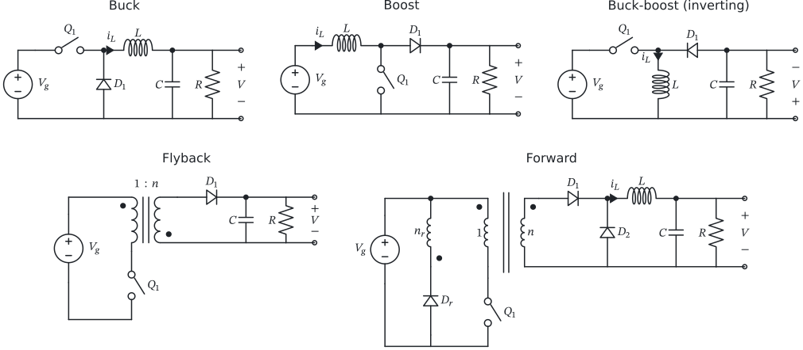

[English](#english) · [한국어](#한국어) · [中文](#中文)

</div>

---

## English

An open learning repository on power electronics for electrical engineers
(in English, Korean and Chinese) and a web app that puts **learning**,
**design** and **simulation** in one place. It covers switching-converter theory
(CCM/DCM), the basic topologies, magnetics and losses, energy-harvesting
interfaces and bench practice, with LTspice, ngspice and CircuitJS1
(Falstad) files for the five basic converters and nine missions that put the
pages and tools to work.

<table>
<tr>
<td width="50%" valign="top">

**Learn.** Each page states what it teaches, derives the result, and
explains every symbol beside the equation. It then works an example,
links to a tool preset, lists the gotchas and ends with a quiz.

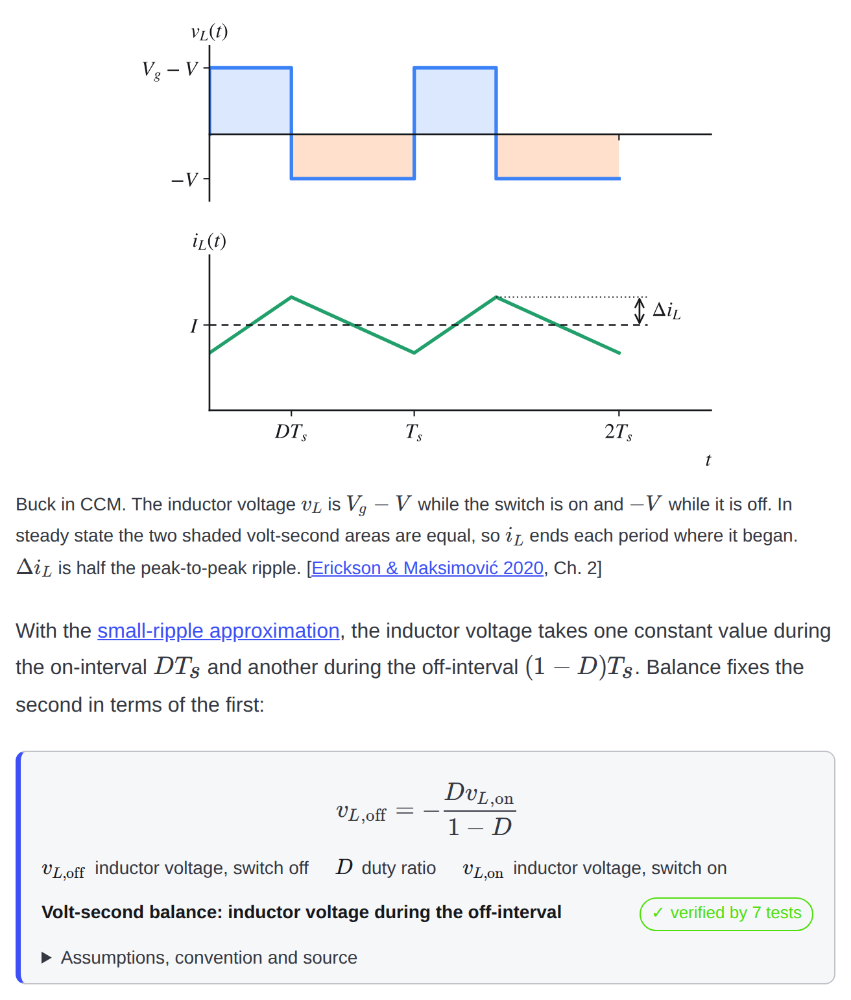

</td>
<td width="50%" valign="top">

**Design.** Calculators for the converter, its magnetics, its losses, the
flyback clamp, the harvesting source and the current-sense chain. Each
result names the equation it comes from.

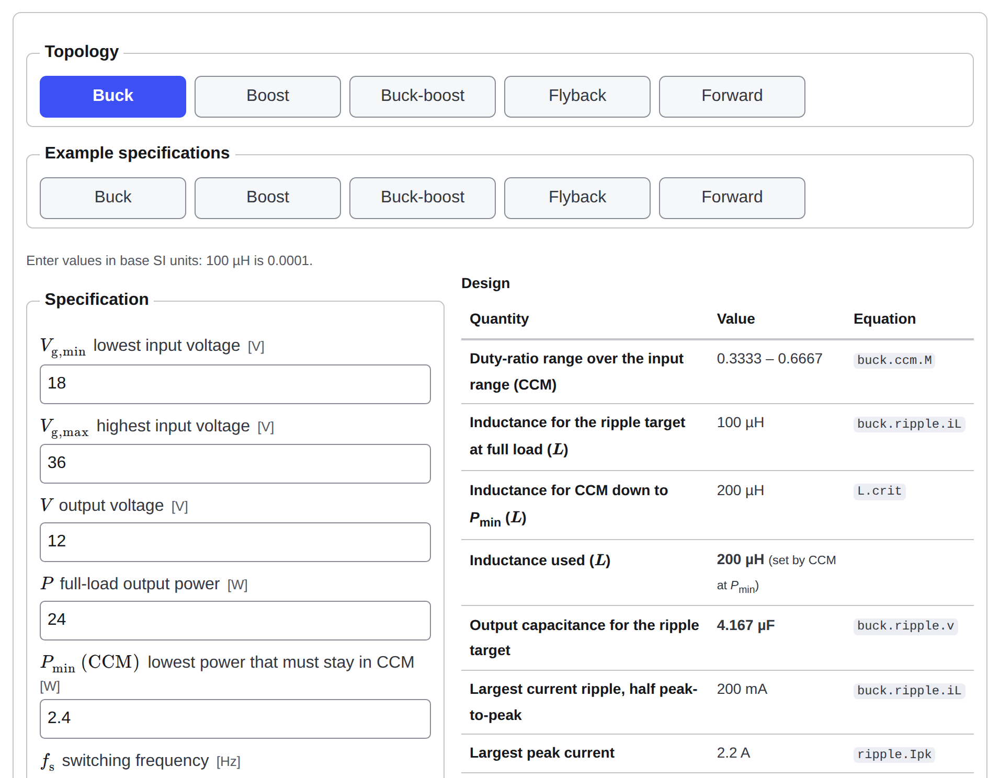

</td>
</tr>
<tr>
<td colspan="2" valign="top">

**Simulate.** A time-domain simulator in the browser: pick a topology, enter
values with SI prefixes and units (100 µH, 200 kHz, 30 %) or move a slider,
and the waveforms, the operating mode and the losses follow. Step through the
period mode by mode, with the circuit's current paths and each element's
state, or see every mode at once: the key waveforms with the modes'
boundaries, then each mode's circuit. Every result sits next to the formula's
value; the simulator is validated against the formulas to within 2 % and
against ngspice. With a resistive load and no Thevenin source, one link opens
the same values in CircuitJS1.

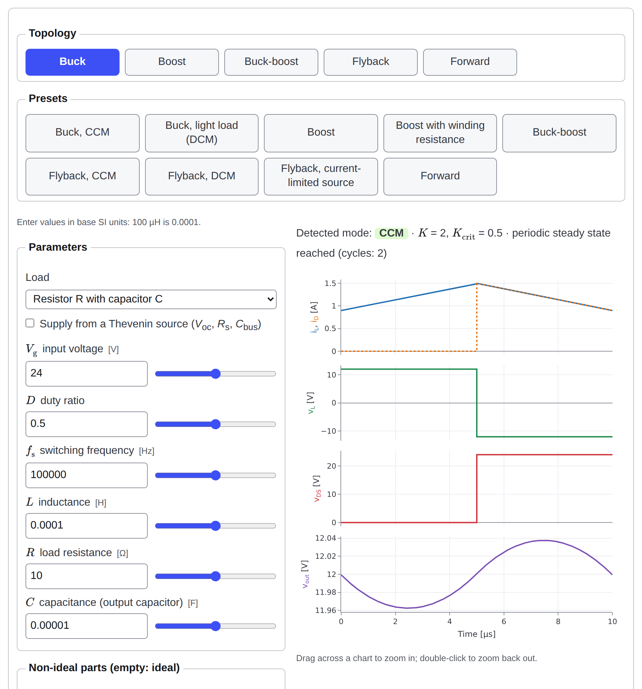

</td>
</tr>
</table>

### How the numbers stay right

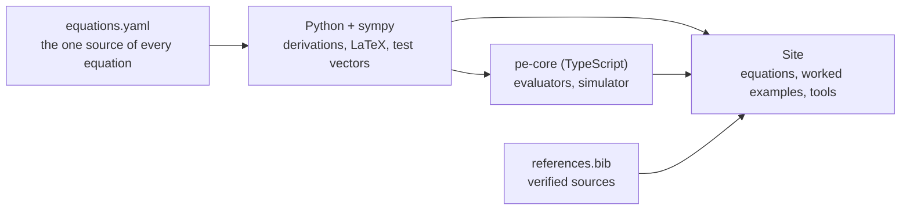
```mermaid
flowchart LR
  Y["equations.yaml<br/>the one source of every equation"] --> P["Python + sympy<br/>derivations, LaTeX, test vectors"]
  P --> T["pe-core (TypeScript)<br/>evaluators, simulator"]
  P --> S["Site<br/>equations, worked examples, tools"]
  T --> S
  B["references.bib<br/>verified sources"] --> S
```

- Every equation is written once, in `packages/pe-core/equations/equations.yaml`.
  sympy reproduces its derivation and generates its LaTeX. The TypeScript
  engine must match the Python reference on shared test vectors to 1e-9
  relative.
- Every equation and every claim about a device or method cites a
  verified entry of `references.bib`. CI checks each DOI against Crossref,
  opens each link, and fails on a dead one.
- Math renders with KaTeX in strict mode. Figures are drawn from code
  (`scripts/gen_figures.py`). A privacy scan keeps real-project data out
  (`PRIVACY_RULES.md`): example numbers are round teaching values.

### Contents

| Section | Pages |
| --- | --- |
| 00 Foundations | circuit laws, phasors and Laplace, Fourier series, real passives, semiconductor switches |
| 01 Physics | Faraday's law and inductors, transformers, ferrites and B-H, air gap and A_L, core loss |
| 02 Theory | switching principle, volt-second and charge balance, CCM and DCM, the K parameter, averaged models, small-signal models, the RHP zero, control basics, derivations |
| 03 Topologies | buck, boost, buck-boost, flyback, forward, comparison |
| 04 Magnetics | inductor design procedure, winding loss, leakage inductance, snubbers and clamps, measuring magnetics |
| 05 Simulation | the SPICE library in LTspice and ngspice (directives, how long to run, integration settings), the same circuits in CircuitJS1 (its fixed step and the spike where a diode's current has nowhere to go), verifying with Python, how the in-browser simulator works |
| 06 Bench | PCB layout, gate drive, current sensing, probes and measurement bandwidth, thermal design, protection, low temperature |
| 07 Harvesting | source models, matching, the DCM flyback as a loss-free resistor, SECE, SSHI and MPPT, a design case |
| 08 Gotchas | thirteen bench and design mistakes, each from its symptom to its fix |
| 09 Missions | nine missions with acceptance criteria and a progress tracker kept in the browser |
| 10 Resources | books, courses, videos, application notes, tools and papers, each opened and checked; the bibliography |
| Tools | equation explorer, simulator, converter designer, magnetics designer, loss budget, clamp check, source matcher, sense chain |
| SPICE library | `sim/`: the five converters as LTspice schematics and ngspice netlists, with what to plot and the numbers to expect, and as CircuitJS1 circuits that open on falstad.com |

### Run it locally

Requirements: Node.js ≥ 22.12, Python ≥ 3.11.

```sh
npm install && npm run dev   # site and tools at http://localhost:4321/switching_converter_study/
npm test                     # vitest: pe-core, simulator validation, TS/Python parity
```

<details>
<summary>All checks, as CI runs them</summary>

```sh
npm run typecheck && npm test          # TypeScript types; vitest (pe-core, simulator, tools, TS/Python parity)
pip install -e "python[dev,figures]" && pytest   # sympy derivations and test vectors
python scripts/gen_equations.py        # regenerate LaTeX, test vectors, derivations, bibliography JSON (CI fails on a diff)
python scripts/gen_figures.py --check  # redraw the figures and compare with the committed SVGs
python scripts/mathlint.py             # no hand-typed equations; every <Eq> id exists
python scripts/modulelint.py           # module template, every EN page mirrored in KO and ZH, STATUS.md
python scripts/privacy_scan.py         # privacy rules
python scripts/refcheck.py --online    # citation keys, VERIFY flags, DOIs against Crossref
python scripts/resources_check.py --online   # every resource URL opened and its title matched
python scripts/falstad_library.py --check    # the CircuitJS1 circuits: current, and wired as the SPICE netlists
python scripts/sim_library.py --check        # the SPICE library against ngspice and the equations (needs ngspice)
python scripts/spice_crosscheck.py --check   # the simulator against ngspice (needs ngspice)
npx playwright install --with-deps chromium   # the headless browser of the three browser checks
node scripts/falstad_check.mjs         # every CircuitJS1 share link run on falstad.com
npm run build                          # strict KaTeX build (fails on a math error), then scripts/postbuild.mjs
bash scripts/repro_check.sh            # HEAD's files at another path build the same site, byte for byte
python scripts/anchorcheck.py dist     # every #fragment link lands (after the build)
node scripts/keyboard_check.mjs        # keyboard focus order of the tool pages (after the build)
node scripts/seq_check.mjs             # the operating-mode drawing's real text boxes (after the build)
rm -rf _linkcheck && mkdir _linkcheck && cp -r dist _linkcheck/switching_converter_study   # the site under its Pages path
lychee --config lychee.toml --root-dir "$PWD/_linkcheck" _linkcheck   # every link (the lychee binary, not the npm package of that name)
```

</details>

### Repository map

| Path | Contents |
| --- | --- |
| `CLAUDE.md`, `PRIVACY_RULES.md` | binding conventions; what may never be committed |
| `docs/BUILD_SPEC.md`, `docs/STATUS.md`, `docs/ADR/` | build specification and phases; module status; decision records |
| `packages/pe-core/` | TypeScript engine; `equations/` holds the one source of truth |
| `python/pe_core/` | verification: sympy derivations, LaTeX and vector generation |
| `examples/synthetic/` | the parameter sets behind every worked example and preset |
| `sim/` | the SPICE library: LTspice schematics, ngspice netlists, CircuitJS1 circuits and share links, their READMEs and waveforms |
| `scripts/` | generators, lints, screenshots |
| `src/` | Astro + Starlight site: pages (`content/docs/en`, `content/docs/ko`, `content/docs/zh`), components, tools |

### Roadmap

| Phase | Scope | State |
| --- | --- | --- |
| 0 | Scaffold, CI, Pages deployment, equation pipeline | done |
| 1 | Equation engine: derivations, parity, math and citation lints | done |
| 2 | Core content: foundations, physics, theory, topologies (EN + KO) | done |
| 3 | Time-domain simulator and design tools: simulator, converter designer, magnetics designer, loss budget, clamp check, source matcher, sense chain | done |
| 4 | Magnetics, bench, harvesting, gotchas, resources | done |
| 5 | LTspice/ngspice library, CircuitJS1 circuits, missions, simulation pages, reproducible build; v0.1.0 | done |

The latest release is **v0.2.0**. v0.1.0 completed the phases above; v0.2.0 adds the Chinese version and a wording pass over the English and Korean text. What each release holds is in [`CHANGELOG.md`](CHANGELOG.md).

### Contributing and licences

See `CONTRIBUTING.md` for the module template, the equation workflow and
the citation rules. Documentation: CC BY-SA 4.0 (`LICENSE-DOCS`). Code: MIT
(`LICENSE-CODE`).

---

## 한국어

전기공학 엔지니어를 위한 전력전자 공개 학습 저장소(영어 원본, 한국어·중국어 미러)이자
**학습**, **설계**, **시뮬레이션**을 한곳에 모은 웹 앱입니다. 스위칭 컨버터
이론(CCM/DCM), 기본 토폴로지, 자성 부품, 손실, 에너지 하베스팅 인터페이스, 벤치
실습을 다루며, 다섯 가지 기본 컨버터의 LTspice·ngspice·CircuitJS1(Falstad) 파일과
페이지·도구를 직접 써 보는 아홉 가지 미션을 함께 제공합니다.

<table>
<tr>
<td width="50%" valign="top">

**학습.** 각 페이지는 목표를 밝히고 결과를 유도하며, 수식 바로 옆에서 모든
기호를 설명합니다. 이어서 예제를 풀고, 도구 프리셋으로 연결하고, 주의할 점을
짚은 뒤 퀴즈로 마무리합니다.

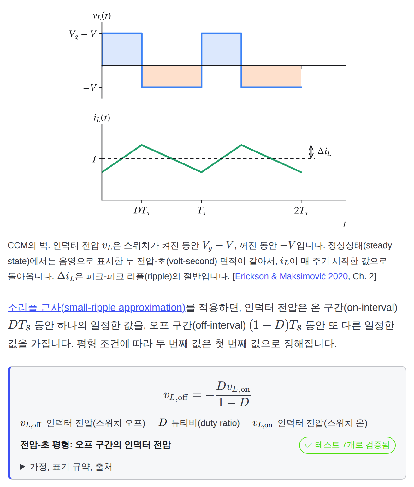

</td>
<td width="50%" valign="top">

**설계.** 컨버터, 자성 부품, 손실, 플라이백 클램프, 하베스팅 전원, 전류 센싱
체인을 위한 계산 도구입니다. 모든 결과에 그 값을 낸 수식이 표시됩니다.

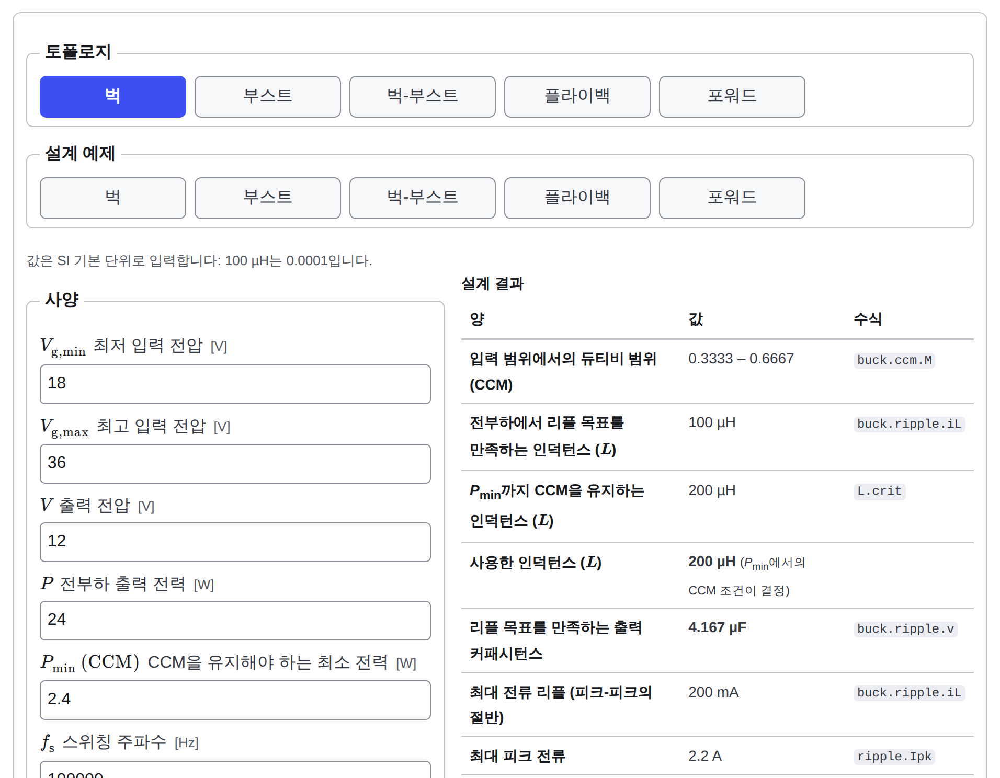

</td>
</tr>
<tr>
<td colspan="2" valign="top">

**시뮬레이션.** 브라우저에서 동작하는 시간 영역(time-domain) 시뮬레이터입니다.
토폴로지를 고르고 값을 SI 접두어와 단위로 입력하거나(100 µH, 200 kHz, 30 %)
슬라이더를 움직이면 파형, 동작 모드, 손실이 바로 바뀝니다. 한 주기를 모드별로
따라가며 회로의 전류 경로와 소자의 상태를 볼 수 있고, 모든 모드를 한 번에 볼
수도 있습니다(모드 경계를 표시한 주요 파형과 각 모드의 회로). 모든 결과는 수식의
값과 나란히 표시되며, 시뮬레이터는 수식과 2 % 이내로, 그리고 ngspice와
일치하도록 검증되었습니다. 테브난 전원(Thevenin source) 없이 저항 부하라면 링크
하나로 같은 값을 CircuitJS1에서 열 수 있습니다.

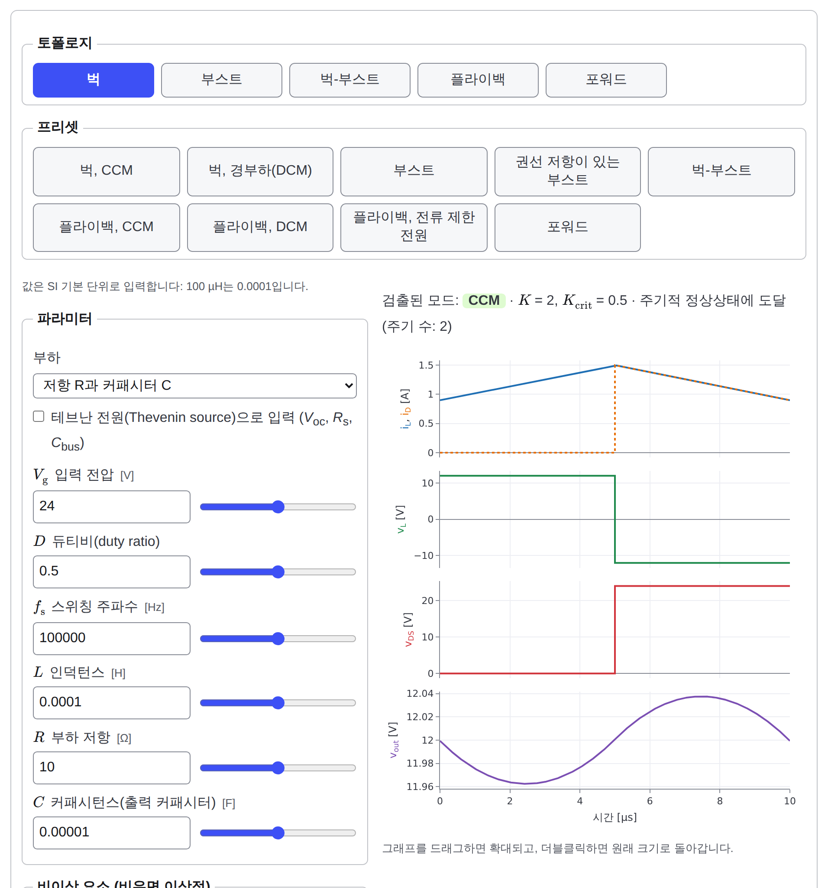

</td>
</tr>
</table>

### 수치가 정확하게 유지되는 방법

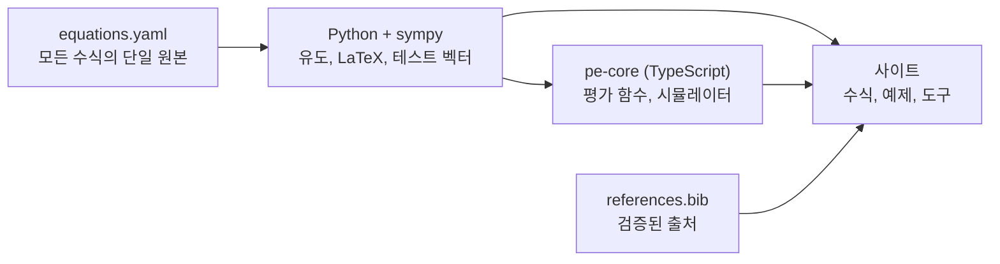
```mermaid
flowchart LR
  Y["equations.yaml<br/>모든 수식의 단일 원본"] --> P["Python + sympy<br/>유도, LaTeX, 테스트 벡터"]
  P --> T["pe-core (TypeScript)<br/>평가 함수, 시뮬레이터"]
  P --> S["사이트<br/>수식, 예제, 도구"]
  T --> S
  B["references.bib<br/>검증된 출처"] --> S
```

- 모든 수식은 `packages/pe-core/equations/equations.yaml`에 한 번만 적습니다.
  sympy가 유도 과정(derivation)을 재현하고 LaTeX를 생성하며, TypeScript 엔진은
  공유 테스트 벡터에서 Python 기준 구현과 상대 오차 1e-9 이내로 일치해야 합니다.
- 모든 수식과, 소자·방법에 대한 모든 주장은 `references.bib`의 검증된 항목을
  인용합니다. CI는 모든 DOI를 Crossref와 대조하고 모든 링크를 열어 보며,
  끊어진 링크가 있으면 실패합니다.
- 수식은 KaTeX 엄격 모드(strict mode)로 렌더링하고, 그림은 코드로 그립니다
  (`scripts/gen_figures.py`). 개인정보 스캔이 실제 프로젝트의 데이터를 막으며
  (`PRIVACY_RULES.md`), 예제 수치는 교육용 어림수입니다.

### 내용

| 구분 | 페이지 |
| --- | --- |
| 00 기초 | 회로 법칙, 페이저와 라플라스 변환, 푸리에 급수, 실제 수동 소자, 반도체 스위치 |
| 01 물리 | 패러데이 법칙과 인덕터, 변압기, 페라이트와 B-H 곡선, 공극과 A_L, 코어 손실 |
| 02 이론 | 스위칭 원리, 전압-초 평형과 전하 평형, CCM과 DCM, K 파라미터, 평균 모델, 소신호 모델, 우반평면(RHP) 영점, 제어 기초, 유도 과정 |
| 03 토폴로지 | 벅, 부스트, 벅-부스트, 플라이백, 포워드, 비교 |
| 04 자성 부품 | 인덕터 설계 절차, 권선 손실, 누설 인덕턴스, 스너버와 클램프, 자성 부품 측정 |
| 05 시뮬레이션 | LTspice·ngspice로 보는 SPICE 라이브러리(지시문, 실행 길이, 적분 설정), CircuitJS1로 보는 같은 회로(고정 시간 간격, 전류가 갈 곳 없는 다이오드에서 생기는 스파이크), Python으로 검증하기, 브라우저 시뮬레이터의 동작 원리 |
| 06 벤치 | PCB 레이아웃, 게이트 구동, 전류 센싱, 프로브와 측정 대역폭, 열 설계, 보호 회로, 저온 |
| 07 하베스팅 | 전원 모델, 정합, 무손실 저항으로 동작하는 DCM 플라이백, SECE·SSHI·MPPT, 설계 사례 |
| 08 주의할 점 | 벤치와 설계에서 흔한 열세 가지 실수, 각각 증상부터 해결까지 |
| 09 미션 | 완료 기준과 브라우저에 저장되는 진행 상황을 갖춘 아홉 가지 미션 |
| 10 자료 | 도서, 강좌, 동영상, 응용 노트, 도구, 논문(모두 열어 확인), 참고문헌 |
| 도구 | 수식 탐색기, 시뮬레이터, 컨버터 설계 도구, 자성 부품 설계 도구, 손실 예산, 클램프 점검, 전원 정합, 센스 체인 |
| SPICE 라이브러리 | `sim/`: 다섯 가지 컨버터의 LTspice 회로도와 ngspice 넷리스트, 그릴 것과 기대할 수치, 그리고 falstad.com에서 열리는 CircuitJS1 회로 |

### 로컬에서 실행하기

필요 사항: Node.js ≥ 22.12, Python ≥ 3.11.

```sh
npm install && npm run dev   # 사이트와 도구: http://localhost:4321/switching_converter_study/
npm test                     # vitest: pe-core, 시뮬레이터 검증, TS/Python 패리티
```

<details>
<summary>CI가 실행하는 모든 검사</summary>

```sh
npm run typecheck && npm test          # TypeScript 타입 검사, vitest (pe-core, 시뮬레이터, 도구, TS/Python 패리티)
pip install -e "python[dev,figures]" && pytest   # sympy 유도와 테스트 벡터
python scripts/gen_equations.py        # LaTeX·테스트 벡터·유도·참고문헌 JSON 재생성 (차이가 있으면 CI 실패)
python scripts/gen_figures.py --check  # 그림을 다시 그려 커밋된 SVG와 비교
python scripts/mathlint.py             # 손으로 쓴 수식 금지, 모든 <Eq> id 존재
python scripts/modulelint.py           # 모듈 템플릿, 모든 영어 페이지의 한국어·중국어 미러, STATUS.md
python scripts/privacy_scan.py         # 개인정보 규칙
python scripts/refcheck.py --online    # 인용 키, VERIFY 표시, Crossref로 DOI 확인
python scripts/resources_check.py --online   # 모든 자료 URL을 열어 제목 대조
python scripts/falstad_library.py --check    # CircuitJS1 회로: 최신인지, SPICE 넷리스트대로 배선됐는지
python scripts/sim_library.py --check        # SPICE 라이브러리를 ngspice와 수식에 대조 (ngspice 필요)
python scripts/spice_crosscheck.py --check   # 시뮬레이터를 ngspice와 대조 (ngspice 필요)
npx playwright install --with-deps chromium   # 브라우저 검사 세 가지에 쓰는 헤드리스 브라우저
node scripts/falstad_check.mjs         # 모든 CircuitJS1 공유 링크를 falstad.com에서 실행
npm run build                          # KaTeX 엄격 빌드 (수식 오류 시 실패), 이어서 scripts/postbuild.mjs
bash scripts/repro_check.sh            # 다른 경로에 푼 HEAD의 파일이 바이트 단위로 같은 사이트를 빌드하는지
python scripts/anchorcheck.py dist     # 모든 #fragment 링크의 대상 존재 (빌드 후)
node scripts/keyboard_check.mjs        # 도구 페이지의 키보드 포커스 순서 (빌드 후)
node scripts/seq_check.mjs             # 동작 모드 회로도의 실제 글자 상자 (빌드 후)
rm -rf _linkcheck && mkdir _linkcheck && cp -r dist _linkcheck/switching_converter_study   # Pages 경로 아래의 사이트
lychee --config lychee.toml --root-dir "$PWD/_linkcheck" _linkcheck   # 모든 링크 (npm의 같은 이름 패키지가 아닌 lychee 실행 파일)
```

</details>

### 저장소 구조

| 경로 | 내용 |
| --- | --- |
| `CLAUDE.md`, `PRIVACY_RULES.md` | 구속력 있는 규약, 절대 커밋하면 안 되는 것 |
| `docs/BUILD_SPEC.md`, `docs/STATUS.md`, `docs/ADR/` | 빌드 명세와 단계, 모듈 진행 상황, 결정 기록 |
| `packages/pe-core/` | TypeScript 엔진; `equations/`가 단일 원본(single source of truth) |
| `python/pe_core/` | 검증: sympy 유도, LaTeX·벡터 생성 |
| `examples/synthetic/` | 모든 예제와 프리셋의 파라미터 |
| `sim/` | SPICE 라이브러리: LTspice 회로도, ngspice 넷리스트, CircuitJS1 회로와 공유 링크, 그 README와 파형 |
| `scripts/` | 생성기, 린트, 스크린샷 |
| `src/` | Astro + Starlight 사이트: 페이지(`content/docs/en`, `content/docs/ko`, `content/docs/zh`), 컴포넌트, 도구 |

### 로드맵

| 단계 | 범위 | 상태 |
| --- | --- | --- |
| 0 | 골격, CI, Pages 배포, 수식 파이프라인 | 완료 |
| 1 | 수식 엔진: 유도, 패리티, 수식·인용 린트 | 완료 |
| 2 | 핵심 콘텐츠: 기초, 물리, 이론, 토폴로지(영어·한국어) | 완료 |
| 3 | 시간 영역 시뮬레이터와 설계 도구: 시뮬레이터, 컨버터 설계, 자성 부품 설계, 손실 예산, 클램프 점검, 전원 정합, 센스 체인 | 완료 |
| 4 | 자성 부품, 벤치, 하베스팅, 주의할 점, 자료 | 완료 |
| 5 | LTspice/ngspice 라이브러리, CircuitJS1 회로, 미션, 시뮬레이션 페이지, 재현 가능한 빌드, v0.1.0 | 완료 |

최신 릴리스는 **v0.2.0**입니다. v0.1.0에서 위의 단계를 마쳤고, v0.2.0에서 중국어판을 더하고 영어와 한국어 문구를 다듬었습니다. 각 릴리스의 내용은 [`CHANGELOG.md`](CHANGELOG.md)에 있습니다.

### 기여와 라이선스

모듈 템플릿, 수식 작업 흐름, 인용 규칙은 `CONTRIBUTING.md`를 참고하세요.
문서: CC BY-SA 4.0(`LICENSE-DOCS`). 코드: MIT(`LICENSE-CODE`).

---

## 中文

这是一个面向电气工程师的开放式电力电子学习资源库（英文、韩文和中文），也是一个把**学习**、**设计**和**仿真**集于一处的 Web 应用。内容涵盖开关变换器理论（CCM/DCM）、基本拓扑、磁性元件与损耗、能量收集接口和实验台实践，并附有五种基本变换器的 LTspice、ngspice 和 CircuitJS1（Falstad）文件，以及九个运用这些页面和工具的任务。

<table>
<tr>
<td width="50%" valign="top">

**学习**。每个页面说明所教内容，推导出结果，并在公式旁解释每个符号。随后讲解一个例题，链接到工具预设，列出易错点，最后以测验结束。

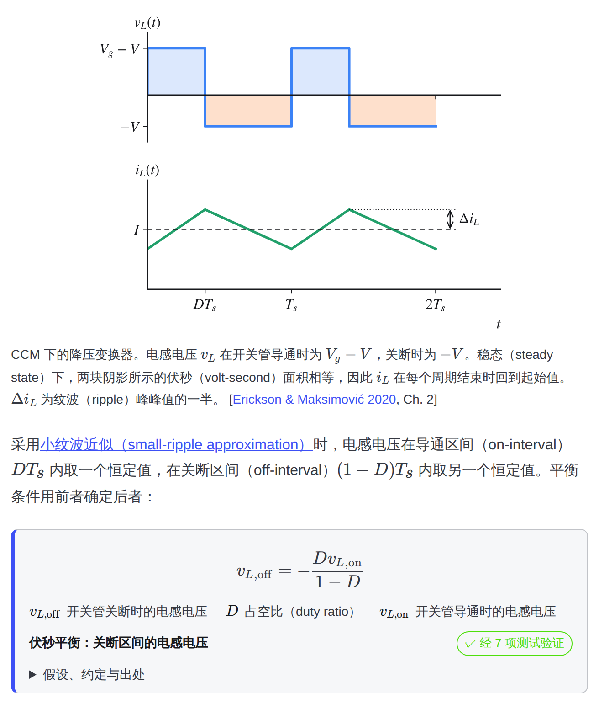

</td>
<td width="50%" valign="top">

**设计**。针对变换器及其磁性元件与损耗、反激变换器的钳位电路、能量收集源和电流检测链的计算器。每个结果都标明其所依据的公式。

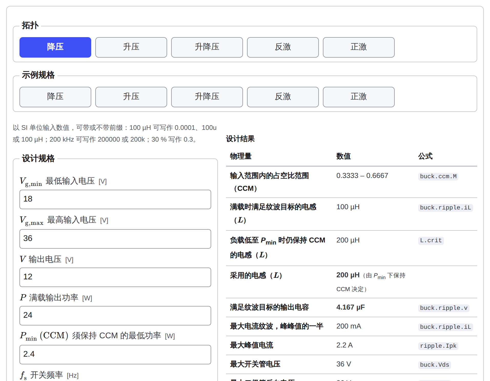

</td>
</tr>
<tr>
<td colspan="2" valign="top">

**仿真**。在浏览器中运行的时域（time-domain）仿真器：选择拓扑，用 SI 前缀和单位输入数值（100 µH、200 kHz、30 %）或拖动滑块，波形、工作模式和损耗随之更新。可以按模态单步查看一个周期，并显示电路中的电流路径和每个元件的状态；也可以一次查看全部模态：先是标有模态边界的主要波形，然后是各模态下的电路。每个结果都与公式的值并列显示；仿真器已对照公式（偏差在 2 % 以内）和 ngspice 进行验证。负载为电阻且没有戴维南电源（Thevenin source）时，一个链接即可在 CircuitJS1 中打开同一组数值。

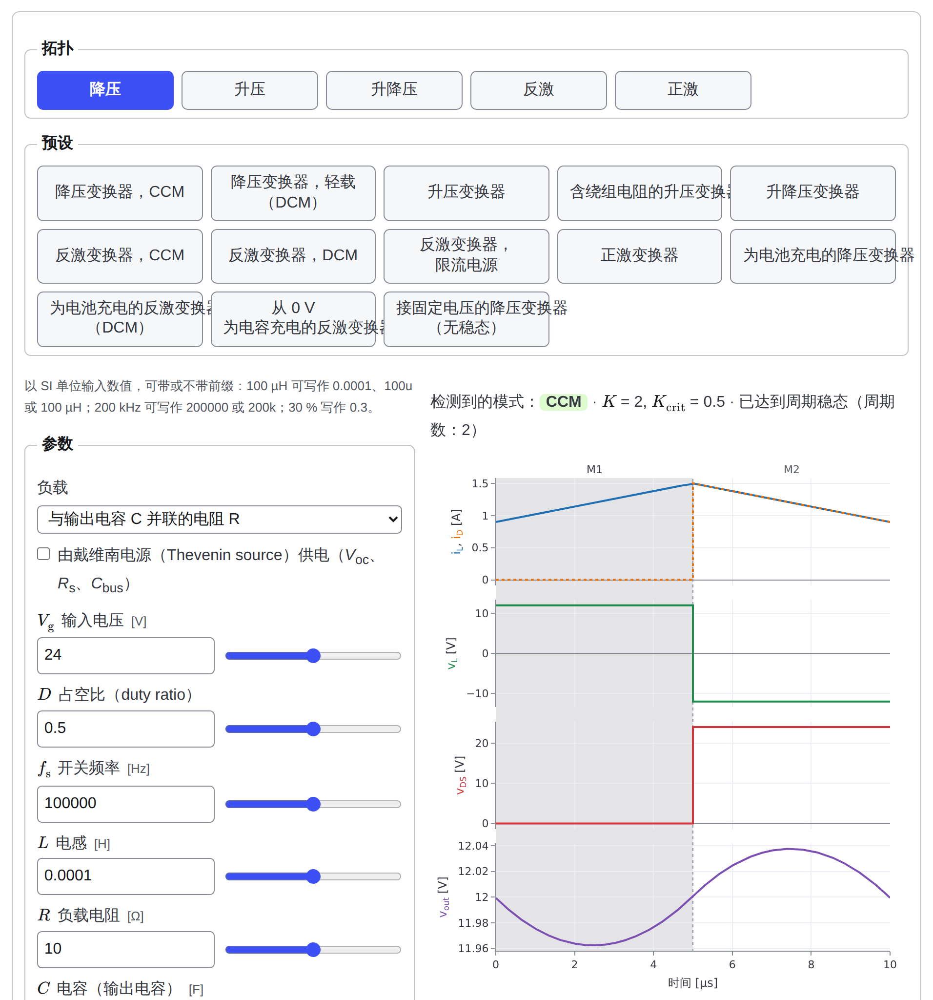

</td>
</tr>
</table>

### 如何保证数值正确

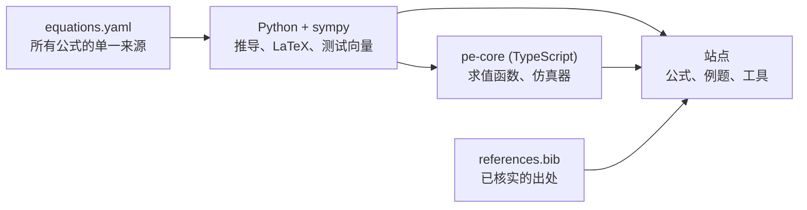
```mermaid
flowchart LR
  Y["equations.yaml<br/>所有公式的单一来源"] --> P["Python + sympy<br/>推导、LaTeX、测试向量"]
  P --> T["pe-core (TypeScript)<br/>求值函数、仿真器"]
  P --> S["站点<br/>公式、例题、工具"]
  T --> S
  B["references.bib<br/>已核实的出处"] --> S
```

- 每个公式只在 `packages/pe-core/equations/equations.yaml` 中写一次。sympy 复现其推导（derivation）并生成其 LaTeX。TypeScript 引擎必须在共享测试向量上与 Python 参考实现一致，相对误差在 1e-9 以内。
- 每个公式以及每条关于器件或方法的论断都引用 `references.bib` 中已核实的条目。CI 对照 Crossref 核对每个 DOI，打开每个链接，遇到失效链接即失败。
- 数学公式用 KaTeX 以严格模式（strict mode）渲染。插图由代码绘制（`scripts/gen_figures.py`）。隐私扫描拦截真实项目的数据（`PRIVACY_RULES.md`）：示例数值都是取整的教学用数值。

### 内容

| 部分 | 页面 |
| --- | --- |
| 00 基础 | 电路定律、相量与拉普拉斯变换、傅里叶级数、实际无源元件、半导体开关 |
| 01 物理 | 法拉第定律与电感、变压器、铁氧体与 B-H 曲线、气隙与 A_L、磁芯损耗 |
| 02 理论 | 开关变换原理、伏秒平衡与电荷平衡、CCM 与 DCM、参数 K、平均模型、小信号模型、右半平面（RHP）零点、控制基础、推导 |
| 03 拓扑 | 降压、升压、升降压、反激、正激、比较 |
| 04 磁性元件 | 电感设计步骤、绕组损耗、漏感、缓冲电路与钳位电路、磁性元件的测量 |
| 05 仿真 | LTspice 与 ngspice 中的 SPICE 库（仿真指令、需要运行多久、积分设置）、CircuitJS1 中的相同电路（其固定时间步长与二极管电流无处可去时出现的尖峰）、用 Python 验证、浏览器内仿真器的工作原理 |
| 06 实验台 | PCB 布局、栅极驱动、电流检测、探头与测量带宽、热设计、保护电路、低温 |
| 07 能量收集 | 电源模型、匹配、作为无损电阻的 DCM 反激变换器、SECE、SSHI 与 MPPT、设计实例 |
| 08 易错点 | 实验台和设计中的十三个错误，每个都从现象讲到解决方法 |
| 09 任务 | 九个带验收标准的任务，以及保存在浏览器中的进度记录 |
| 10 资料 | 图书、课程、视频、应用笔记、工具和论文，每项均已打开核对；参考文献 |
| 工具 | 公式浏览器、仿真器、变换器设计工具、磁性元件设计工具、损耗预算、钳位检查、源匹配、电流检测链 |
| SPICE 库 | `sim/`：五种变换器的 LTspice 原理图和 ngspice 网表（附应绘制的量和预期数值），以及可在 falstad.com 上打开的 CircuitJS1 电路 |

### 在本地运行

环境要求：Node.js ≥ 22.12、Python ≥ 3.11。

```sh
npm install && npm run dev   # 站点和工具：http://localhost:4321/switching_converter_study/
npm test                     # vitest：pe-core、仿真器验证、TS/Python 一致性
```

<details>
<summary>CI 运行的全部检查</summary>

```sh
npm run typecheck && npm test          # TypeScript 类型检查；vitest（pe-core、仿真器、工具、TS/Python 一致性）
pip install -e "python[dev,figures]" && pytest   # sympy 推导与测试向量
python scripts/gen_equations.py        # 重新生成 LaTeX、测试向量、推导和参考文献 JSON（有差异时 CI 失败）
python scripts/gen_figures.py --check  # 重绘插图并与已提交的 SVG 比较
python scripts/mathlint.py             # 不允许手写公式；每个 <Eq> id 都存在
python scripts/modulelint.py           # 模块模板、每个英文页面的韩文与中文镜像、STATUS.md
python scripts/privacy_scan.py         # 隐私规则
python scripts/refcheck.py --online    # 引用键、VERIFY 标记、对照 Crossref 核对 DOI
python scripts/resources_check.py --online   # 打开每个资料 URL 并核对其标题
python scripts/falstad_library.py --check    # CircuitJS1 电路：是否最新，接线是否与 SPICE 网表一致
python scripts/sim_library.py --check        # 用 ngspice 和公式核对 SPICE 库（需要 ngspice）
python scripts/spice_crosscheck.py --check   # 用 ngspice 核对仿真器（需要 ngspice）
npx playwright install --with-deps chromium   # 三项浏览器检查所用的无头浏览器
node scripts/falstad_check.mjs         # 在 falstad.com 上运行每个 CircuitJS1 分享链接
npm run build                          # KaTeX 严格模式构建（公式出错即失败），然后运行 scripts/postbuild.mjs
bash scripts/repro_check.sh            # HEAD 的文件放在另一路径下，构建出逐字节相同的站点
python scripts/anchorcheck.py dist     # 每个 #fragment 链接的目标都存在（构建后）
node scripts/keyboard_check.mjs        # 工具页面的键盘焦点顺序（构建后）
node scripts/seq_check.mjs             # 工作模态图中文字的实际边界框（构建后）
rm -rf _linkcheck && mkdir _linkcheck && cp -r dist _linkcheck/switching_converter_study   # 置于 Pages 路径下的站点
lychee --config lychee.toml --root-dir "$PWD/_linkcheck" _linkcheck   # 每个链接（lychee 可执行文件，而非 npm 上的同名包）
```

</details>

### 仓库结构

| 路径 | 内容 |
| --- | --- |
| `CLAUDE.md`, `PRIVACY_RULES.md` | 必须遵守的约定；绝不能提交的内容 |
| `docs/BUILD_SPEC.md`, `docs/STATUS.md`, `docs/ADR/` | 构建规范与各阶段；模块状态；决策记录 |
| `packages/pe-core/` | TypeScript 引擎；`equations/` 存放单一事实来源（single source of truth） |
| `python/pe_core/` | 验证：sympy 推导、LaTeX 与向量生成 |
| `examples/synthetic/` | 每个例题和预设所依据的参数集 |
| `sim/` | SPICE 库：LTspice 原理图、ngspice 网表、CircuitJS1 电路与分享链接，以及各自的 README 和波形 |
| `scripts/` | 生成器、lint 检查、截图 |
| `src/` | Astro + Starlight 站点：页面（`content/docs/en`、`content/docs/ko`、`content/docs/zh`）、组件、工具 |

### 路线图

| 阶段 | 范围 | 状态 |
| --- | --- | --- |
| 0 | 站点框架、CI、Pages 部署、公式流水线 | 已完成 |
| 1 | 公式引擎：推导、一致性、公式与引用的 lint 检查 | 已完成 |
| 2 | 核心内容：基础、物理、理论、拓扑（英文与韩文） | 已完成 |
| 3 | 时域仿真器与设计工具：仿真器、变换器设计工具、磁性元件设计工具、损耗预算、钳位检查、源匹配、电流检测链 | 已完成 |
| 4 | 磁性元件、实验台、能量收集、易错点、资料 | 已完成 |
| 5 | LTspice/ngspice 库、CircuitJS1 电路、任务、仿真页面、可复现构建；v0.1.0 | 已完成 |

最新版本为 **v0.2.0**。v0.1.0 完成了上述各阶段，v0.2.0 新增中文版，并修订了英文和韩文的措辞。各版本的内容见 [`CHANGELOG.md`](CHANGELOG.md)。

### 贡献与许可证

模块模板、公式工作流程和引用规则见 `CONTRIBUTING.md`。文档：CC BY-SA 4.0（`LICENSE-DOCS`）。代码：MIT（`LICENSE-CODE`）。
