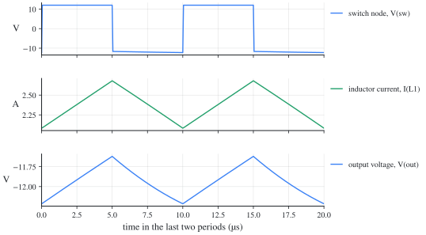

# Buck-boost converter (inverting): LTspice schematics

[한국어](#한국어)

Each file carries the numbers of a synthetic example (not from any design), the example the in-browser [simulator](https://denny-hwang.github.io/switching_converter_study/en/simulate/simulator/) also opens with its preset of the same name. The same circuits as ngspice netlists: [../../ngspice/buckboost/](../../ngspice/buckboost/).

| File | Example | Mode | Preset |
| --- | --- | --- | --- |
| [buckboost-ccm.asc](buckboost-ccm.asc) | Buck-boost example (`buckboost-basic`): V_g = 12 V, D = 0.5, f_s = 100 kHz, L = 100 µH, C = 10 µF, R = 10 Ω | CCM | buckboost |

## Run

Open the file in LTspice and press Run: the schematic carries its `.param`, `.model` and `.tran` lines. The run starts from rest and lasts several hundred periods, so the last ones are the steady state. Click a node for its voltage and a part for its current; the node names are the ngspice netlist's.

## buckboost-ccm

Plot: `V(sw)` (switch node), `I(L1)` (inductor current), `V(out)` (output voltage).

| Quantity | ngspice | Ideal | From the catalogue |
| --- | --- | --- | --- |
| output voltage, average | -11.93 V | -12 V | `buckboost.ccm.M` |
| inductor current, average | 2.383 A | 2.4 A | `buckboost.IL` |
| inductor current, largest | 2.681 A | 2.7 A | `buckboost.IL + buckboost.ripple.iL` |
| inductor current, smallest | 2.082 A | 2.1 A | `buckboost.IL - buckboost.ripple.iL` |
| switch node, largest | 12 V | 12 V | `V_g` |
| switch node, smallest | -12.24 V | -12.3 V | `V - buckboost.ripple.v` |

## Notes

- The switch is 1 mΩ on and 1 MΩ off, and the diodes drop about 30 mV at an ampere, so the results land within 1 % of the ideal equations; `scripts/sim_library.py --check` confirms it in CI.
- A transformer is coupled inductors with a coupling of 1: the primary's inductance is the magnetizing inductance (referred to the primary), the turns ratio 1:n with n = N_s/N_p. SPICE takes each inductor's first node as its dotted end; LTspice draws the dot at the other end of every winding, so the relative polarity is the same.
- LTspice puts 1 mΩ in series with an inductor that is not coupled (its help, Inductor Models): less than 0.1 % on these results.

## 한국어

### 벅-부스트 컨버터(반전형): LTspice 회로도

각 파일은 합성 예제(설계에서 가져오지 않은 수)의 값을 씁니다. 브라우저 [시뮬레이터](https://denny-hwang.github.io/switching_converter_study/ko/simulate/simulator/)의 같은 이름 프리셋(preset)도 같은 예제로 열립니다. 같은 회로의 ngspice 넷리스트는 [../../ngspice/buckboost/](../../ngspice/buckboost/)에 있습니다.

| 파일 | 예제 | 모드 | 프리셋 |
| --- | --- | --- | --- |
| [buckboost-ccm.asc](buckboost-ccm.asc) | 벅-부스트 예제 (`buckboost-basic`): V_g = 12 V, D = 0.5, f_s = 100 kHz, L = 100 µH, C = 10 µF, R = 10 Ω | CCM | buckboost |

#### 실행

LTspice에서 파일을 열고 Run을 누릅니다. `.param`, `.model`, `.tran` 줄이 회로도에 있습니다. 정지 상태에서 시작해 수백 주기를 계산하므로, 마지막 주기들이 정상상태(steady state)입니다. 노드를 누르면 전압을, 부품을 누르면 전류를 그립니다. 노드 이름은 ngspice 넷리스트와 같습니다.

#### buckboost-ccm

그릴 것: `V(sw)` (스위치 노드), `I(L1)` (인덕터 전류), `V(out)` (출력 전압).

| 양 | ngspice | 이상적인 식 | 카탈로그의 식 |
| --- | --- | --- | --- |
| 출력 전압, 평균 | -11.93 V | -12 V | `buckboost.ccm.M` |
| 인덕터 전류, 평균 | 2.383 A | 2.4 A | `buckboost.IL` |
| 인덕터 전류, 최댓값 | 2.681 A | 2.7 A | `buckboost.IL + buckboost.ripple.iL` |
| 인덕터 전류, 최솟값 | 2.082 A | 2.1 A | `buckboost.IL - buckboost.ripple.iL` |
| 스위치 노드, 최댓값 | 12 V | 12 V | `V_g` |
| 스위치 노드, 최솟값 | -12.24 V | -12.3 V | `V - buckboost.ripple.v` |

#### 참고

- 스위치는 켜지면 1 mΩ, 꺼지면 1 MΩ이고, 다이오드는 1 A에서 약 30 mV가 떨어집니다. 그래서 결과가 이상적인 식과 1 % 안에서 맞습니다. `scripts/sim_library.py --check`가 CI에서 이를 확인합니다.
- 변압기는 결합 계수 1인 결합 인덕터입니다. 1차 인덕턴스가 자화 인덕턴스(1차 기준)이고, 권선비는 1:n, n = N_s/N_p입니다. SPICE는 각 인덕터의 첫 노드를 점(dot)으로 봅니다. LTspice는 모든 권선에서 점을 다른 끝에 그리므로, 상대 극성은 같습니다.
- LTspice는 결합되지 않은 인덕터에 1 mΩ 직렬 저항을 기본으로 넣습니다(도움말의 Inductor Models). 결과에 주는 영향은 0.1 %보다 작습니다.
