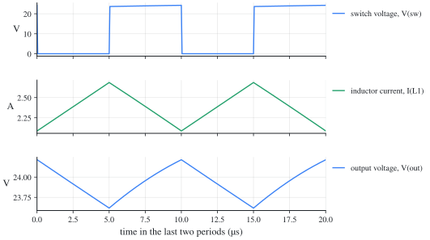

# Boost converter: ngspice netlists

[한국어](#한국어)

Each file carries the numbers of a synthetic example (not from any design), the example the in-browser [simulator](https://denny-hwang.github.io/switching_converter_study/en/simulate/simulator/) also opens with its preset of the same name. The same circuits as LTspice schematics: [../../ltspice/boost/](../../ltspice/boost/).

| File | Example | Mode | Preset |
| --- | --- | --- | --- |
| [boost-ccm.cir](boost-ccm.cir) | Ideal boost example (`boost-ideal`): V_g = 12 V, D = 0.5, f_s = 100 kHz, L = 100 µH, C = 10 µF, R = 20 Ω | CCM | boost |

## Run

```
ngspice -b boost-ccm.cir    # prints the measurements (.meas) of the last period
ngspice boost-ccm.cir       # interactive: run, then plot
```

## boost-ccm

Plot: `v(sw)` (switch voltage), `i(l1)` (inductor current), `v(out)` (output voltage).



| Quantity | ngspice | Ideal | From the catalogue |
| --- | --- | --- | --- |
| output voltage, average | 23.93 V | 24 V | `boost.ccm.M` |
| inductor current, average | 2.388 A | 2.4 A | `boost.IL` |
| inductor current, largest | 2.686 A | 2.7 A | `boost.IL + boost.ripple.iL` |
| inductor current, smallest | 2.087 A | 2.1 A | `boost.IL - boost.ripple.iL` |
| switch voltage, largest | 24.24 V | 24.3 V | `V + boost.ripple.v` |

## Notes

- The switch is 1 mΩ on and 1 MΩ off, and the diodes drop about 30 mV at an ampere, so the results land within 1 % of the ideal equations; `scripts/sim_library.py --check` confirms it in CI.
- A transformer is coupled inductors with a coupling of 1: the primary's inductance is the magnetizing inductance (referred to the primary), the turns ratio 1:n with n = N_s/N_p. SPICE takes each inductor's first node as its dotted end; LTspice draws the dot at the other end of every winding, so the relative polarity is the same.

## 한국어

### 부스트 컨버터: ngspice 넷리스트

각 파일은 합성 예제(설계에서 가져오지 않은 수)의 값을 씁니다. 브라우저 [시뮬레이터](https://denny-hwang.github.io/switching_converter_study/ko/simulate/simulator/)의 같은 이름 프리셋(preset)도 같은 예제로 열립니다. 같은 회로의 LTspice 회로도는 [../../ltspice/boost/](../../ltspice/boost/)에 있습니다.

| 파일 | 예제 | 모드 | 프리셋 |
| --- | --- | --- | --- |
| [boost-ccm.cir](boost-ccm.cir) | 이상적인 부스트 예제 (`boost-ideal`): V_g = 12 V, D = 0.5, f_s = 100 kHz, L = 100 µH, C = 10 µF, R = 20 Ω | CCM | boost |

#### 실행

```
ngspice -b boost-ccm.cir    # 마지막 주기의 측정값(.meas)을 출력합니다
ngspice boost-ccm.cir       # 대화형: run 다음에 plot
```

#### boost-ccm

그릴 것: `v(sw)` (스위치 전압), `i(l1)` (인덕터 전류), `v(out)` (출력 전압).


| 양 | ngspice | 이상적인 식 | 카탈로그의 식 |
| --- | --- | --- | --- |
| 출력 전압, 평균 | 23.93 V | 24 V | `boost.ccm.M` |
| 인덕터 전류, 평균 | 2.388 A | 2.4 A | `boost.IL` |
| 인덕터 전류, 최댓값 | 2.686 A | 2.7 A | `boost.IL + boost.ripple.iL` |
| 인덕터 전류, 최솟값 | 2.087 A | 2.1 A | `boost.IL - boost.ripple.iL` |
| 스위치 전압, 최댓값 | 24.24 V | 24.3 V | `V + boost.ripple.v` |

#### 참고

- 스위치는 켜지면 1 mΩ, 꺼지면 1 MΩ이고, 다이오드는 1 A에서 약 30 mV가 떨어집니다. 그래서 결과가 이상적인 식과 1 % 안에서 맞습니다. `scripts/sim_library.py --check`가 CI에서 이를 확인합니다.
- 변압기는 결합 계수 1인 결합 인덕터입니다. 1차 인덕턴스가 자화 인덕턴스(1차 기준)이고, 권선비는 1:n, n = N_s/N_p입니다. SPICE는 각 인덕터의 첫 노드를 점(dot)으로 봅니다. LTspice는 모든 권선에서 점을 다른 끝에 그리므로, 상대 극성은 같습니다.
