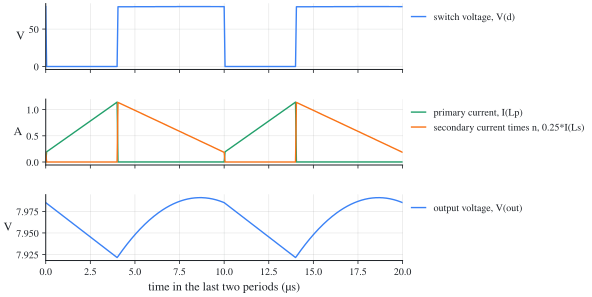
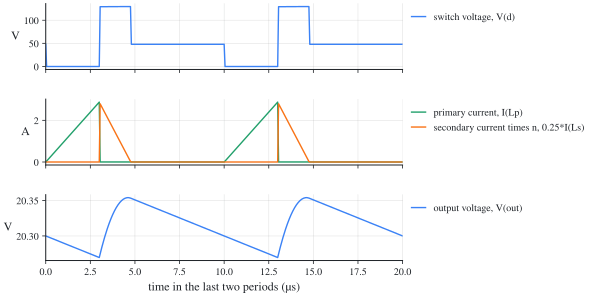

# Flyback converter: ngspice netlists

[한국어](#한국어)

Each file carries the numbers of a synthetic example (not from any design), the example the in-browser [simulator](https://denny-hwang.github.io/switching_converter_study/en/simulate/simulator/) also opens with its preset of the same name. The same circuits as LTspice schematics: [../../ltspice/flyback/](../../ltspice/flyback/).

| File | Example | Mode | Preset |
| --- | --- | --- | --- |
| [flyback-ccm.cir](flyback-ccm.cir) | Flyback example in CCM, ideal diode (`flyback-ccm`): V_g = 48 V, D = 0.4, f_s = 100 kHz, L_M = 200 µH, n = 0.25, C = 100 µF, R = 5 Ω | CCM | Flyback, CCM |
| [flyback-dcm.cir](flyback-dcm.cir) | Flyback example in DCM, ideal diode (`flyback-dcm`): V_g = 48 V, D = 0.3, f_s = 100 kHz, L_M = 50 µH, n = 0.25, C = 100 µF, R = 20 Ω | DCM | Flyback, DCM |

## Run

```
ngspice -b flyback-ccm.cir    # prints the measurements (.meas) of the last period
ngspice flyback-ccm.cir       # interactive: run, then plot
```

## flyback-ccm

Plot: `v(d)` (switch voltage), `i(lp)` (primary current), `0.25*i(ls)` (secondary current times n), `i(lp)+0.25*i(ls)` (magnetizing current), `v(out)` (output voltage).



| Quantity | ngspice | Ideal | From the catalogue |
| --- | --- | --- | --- |
| magnetizing current, average | 0.6636 A | 0.6667 A | `flyback.IM` |
| magnetizing current, largest | 1.143 A | 1.147 A | `flyback.IM + flyback.ripple.iM` |
| magnetizing current, smallest | 0.1833 A | 0.1867 A | `flyback.IM - flyback.ripple.iM` |
| output voltage, average | 7.965 V | 8 V | `flyback.ccm.M` |
| switch voltage, largest | 80.07 V | 80.13 V | `V_g + (V + flyback.ripple.v)/n` |

## flyback-dcm

Plot: `v(d)` (switch voltage), `i(lp)` (primary current), `0.25*i(ls)` (secondary current times n), `i(lp)+0.25*i(ls)` (magnetizing current), `v(out)` (output voltage).



| Quantity | ngspice | Ideal | From the catalogue |
| --- | --- | --- | --- |
| magnetizing current, largest | 2.875 A | 2.88 A | `flyback.Ipk.dcm` |
| magnetizing current, smallest | 4.637e-05 A | 0 A | `DCM: zero` |
| output voltage, average | 20.31 V | 20.36 V | `flyback.dcm.M` |
| switch voltage, largest | 129.5 V | 129.5 V | `V_g + V/n` |

## Notes

- The switch is 1 mΩ on and 1 MΩ off, and the diodes drop about 30 mV at an ampere, so the results land within 1 % of the ideal equations; `scripts/sim_library.py --check` confirms it in CI.
- A transformer is coupled inductors with a coupling of 1: the primary's inductance is the magnetizing inductance (referred to the primary), the turns ratio 1:n with n = N_s/N_p. SPICE takes each inductor's first node as its dotted end; LTspice draws the dot at the other end of every winding, so the relative polarity is the same.
- The `.options` line asks for Gear's integration and a relative tolerance of 1e-4. Without it, at their default settings, ngspice 42 and LTspice 26.1.1 both draw spikes far below zero on the DCM flyback's drain voltage, which the circuit does not have.

## 한국어

### 플라이백 컨버터: ngspice 넷리스트

각 파일은 합성 예제(설계에서 가져오지 않은 수)의 값을 씁니다. 브라우저 [시뮬레이터](https://denny-hwang.github.io/switching_converter_study/ko/simulate/simulator/)의 같은 이름 프리셋(preset)도 같은 예제로 열립니다. 같은 회로의 LTspice 회로도는 [../../ltspice/flyback/](../../ltspice/flyback/)에 있습니다.

| 파일 | 예제 | 모드 | 프리셋 |
| --- | --- | --- | --- |
| [flyback-ccm.cir](flyback-ccm.cir) | CCM 플라이백 예제, 이상적 다이오드 (`flyback-ccm`): V_g = 48 V, D = 0.4, f_s = 100 kHz, L_M = 200 µH, n = 0.25, C = 100 µF, R = 5 Ω | CCM | 플라이백, CCM |
| [flyback-dcm.cir](flyback-dcm.cir) | DCM 플라이백 예제, 이상적 다이오드 (`flyback-dcm`): V_g = 48 V, D = 0.3, f_s = 100 kHz, L_M = 50 µH, n = 0.25, C = 100 µF, R = 20 Ω | DCM | 플라이백, DCM |

#### 실행

```
ngspice -b flyback-ccm.cir    # 마지막 주기의 측정값(.meas)을 출력합니다
ngspice flyback-ccm.cir       # 대화형: run 다음에 plot
```

#### flyback-ccm

그릴 것: `v(d)` (스위치 전압), `i(lp)` (1차 전류), `0.25*i(ls)` (2차 전류 × n), `i(lp)+0.25*i(ls)` (자화 전류), `v(out)` (출력 전압).


| 양 | ngspice | 이상적인 식 | 카탈로그의 식 |
| --- | --- | --- | --- |
| 자화 전류, 평균 | 0.6636 A | 0.6667 A | `flyback.IM` |
| 자화 전류, 최댓값 | 1.143 A | 1.147 A | `flyback.IM + flyback.ripple.iM` |
| 자화 전류, 최솟값 | 0.1833 A | 0.1867 A | `flyback.IM - flyback.ripple.iM` |
| 출력 전압, 평균 | 7.965 V | 8 V | `flyback.ccm.M` |
| 스위치 전압, 최댓값 | 80.07 V | 80.13 V | `V_g + (V + flyback.ripple.v)/n` |

#### flyback-dcm

그릴 것: `v(d)` (스위치 전압), `i(lp)` (1차 전류), `0.25*i(ls)` (2차 전류 × n), `i(lp)+0.25*i(ls)` (자화 전류), `v(out)` (출력 전압).


| 양 | ngspice | 이상적인 식 | 카탈로그의 식 |
| --- | --- | --- | --- |
| 자화 전류, 최댓값 | 2.875 A | 2.88 A | `flyback.Ipk.dcm` |
| 자화 전류, 최솟값 | 4.637e-05 A | 0 A | `DCM: zero` |
| 출력 전압, 평균 | 20.31 V | 20.36 V | `flyback.dcm.M` |
| 스위치 전압, 최댓값 | 129.5 V | 129.5 V | `V_g + V/n` |

#### 참고

- 스위치는 켜지면 1 mΩ, 꺼지면 1 MΩ이고, 다이오드는 1 A에서 약 30 mV가 떨어집니다. 그래서 결과가 이상적인 식과 1 % 안에서 맞습니다. `scripts/sim_library.py --check`가 CI에서 이를 확인합니다.
- 변압기는 결합 계수 1인 결합 인덕터입니다. 1차 인덕턴스가 자화 인덕턴스(1차 기준)이고, 권선비는 1:n, n = N_s/N_p입니다. SPICE는 각 인덕터의 첫 노드를 점(dot)으로 봅니다. LTspice는 모든 권선에서 점을 다른 끝에 그리므로, 상대 극성은 같습니다.
- `.options` 줄은 기어(Gear) 적분법과 상대 허용오차(relative tolerance) 1e-4를 지정합니다. 이 줄이 없으면 기본 설정의 ngspice 42와 LTspice 26.1.1 모두 DCM 플라이백의 드레인 전압에, 회로에는 없는, 0보다 훨씬 낮은 스파이크를 그립니다.
